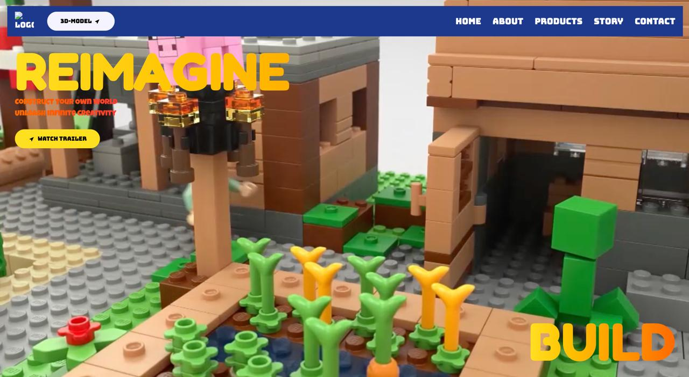
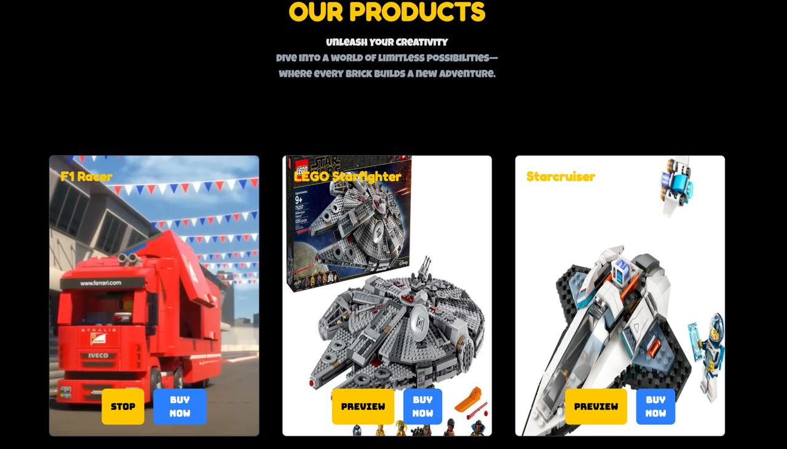

# 🧱 Reimagine LEGO - MockUp 2.0 Hackathon Project

A visually immersive and creatively reimagined website for LEGO, built during the **MockUp 2.0 Hackathon**. This project aims to enhance LEGO’s digital presence with modern UI/UX, 3D model interaction, animation, and intuitive product exploration.

---

## 🌐 Live Website

👉 **[View Live Project](https://ashmit-a-rawat.github.io/mockup2.0/)**  

---

## 🚀 Tech Stack

- **Frontend**: `React`, `HTML`, `CSS`, `JavaScript`  
- **Styling**: `Tailwind CSS`  
- **Animations**: `GSAP (GreenSock Animation Platform)`  
- **3D Modeling & Interaction**: `Spline`, `Three.js (3JS)`

---

## ✨ Features

- 🔥 **Modern UI Design** – Bright, playful, and responsive design capturing LEGO's creative spirit.  
- 🧩 **Interactive 3D Models** – Integrated using [Spline](https://spline.design), allowing users to engage with LEGO sets in a new dimension.  
- 🎞️ **Smooth Animations** – GSAP powers fluid transitions and dynamic component reveals.  
- 🛒 **Product Preview & Purchase** – Cards for LEGO sets with **Preview** and **Buy Now** options.  
- 🌍 **Multi-Section SPA** – Includes Home, About, Products, Story, and Contact, crafted for seamless navigation.

---

## 🎯 Purpose & Inspiration

This was a **college hackathon project** (MockUp 2.0), where the goal was to **reimagine a popular brand’s website**. We chose LEGO for its nostalgic value and creative identity. The result is a digital experience that blends technology with fun.

---

## 📸 Screenshots

### 🔷 Home Page

### 🟡 Products Page

---

## 💡 Future Improvements

- Backend integration for real-time purchases  
- User authentication and profile-based LEGO recommendations  
- More immersive 3D exploration with Three.js  

---

